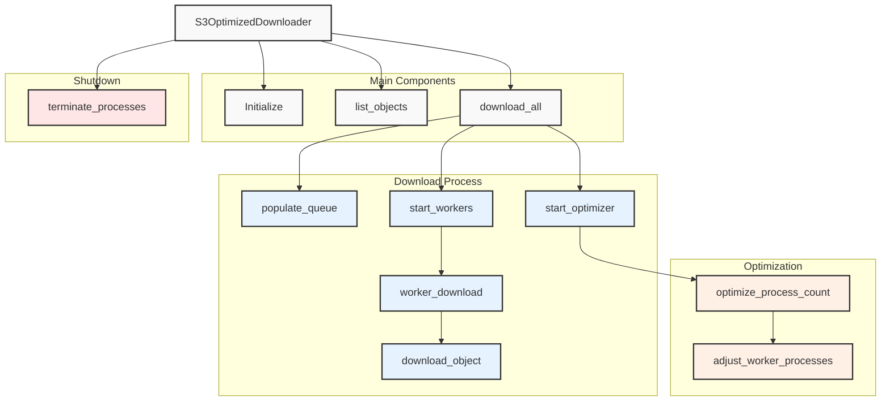

# Super Obj Soaker Architecture

**Comprehensive Overview of the System Design and Components**

## Table of Contents

- [Introduction](#introduction)
- [High-Level Architecture](#high-level-architecture)
- [Components](#components)
  - [SeaweedFS](#seaweedfs)
  - [Docker Services](#docker-services)
  - [S3 Optimized Downloader](#s3-optimized-downloader)
    - [Downloader Core](#downloader-core)
    - [Process Optimization](#process-optimization)
    - [Download Management](#download-management)
    - [Error Handling and Retry Mechanism](#error-handling-and-retry-mechanism)
- [Workflow](#workflow)
  - [Setup and Initialization](#setup-and-initialization)
  - [Object Listing](#object-listing)
  - [Download Process](#download-process)
  - [Optimization Loop](#optimization-loop)
  - [Graceful Shutdown](#graceful-shutdown)
- [Concurrency and Synchronization](#concurrency-and-synchronization)
- [Logging and Monitoring](#logging-and-monitoring)
- [Testing Strategy](#testing-strategy)
- [Scalability and Performance Considerations](#scalability-and-performance-considerations)
- [Security Considerations](#security-considerations)
- [Future Enhancements](#future-enhancements)

## Introduction

Super Obj Soaker is designed to efficiently download large volumes of objects from an S3-compatible storage system. The architecture emphasizes scalability, reliability, and performance optimization by leveraging multi-process concurrency and dynamic resource management to adapt to varying workload demands.

## High-Level Architecture

This diagram illustrates the main components and flow of the S3OptimizedDownloader:

1. **Main Components**: Initialization, object listing, and the main download process.
2. **Download Process**: Queue population, optimizer and worker startup, and the actual download operations.
3. **Optimization**: Process count optimization and worker adjustment.
4. **Shutdown**: Graceful termination of processes.

The S3OptimizedDownloader is designed to efficiently manage concurrent downloads while dynamically adjusting the number of worker processes based on performance metrics.

## Components

### SeaweedFS

- **Description**: SeaweedFS is a distributed object store known for its high performance and scalability. In this setup, it functions as an S3-compatible storage backend.
+ **Description**: **SeaweedFS is utilized exclusively for local testing**. It provides an S3-compatible interface to simulate various S3-type storage environments during development and testing phases.

### Docker Services

- **docker-compose.yaml**: Orchestrates Docker containers, ensuring that services like SeaweedFS and the test runner are correctly initialized and interconnected.
- **Services Defined**:
  - `seaweedfs`: Runs the SeaweedFS server with specified port mappings and command-line arguments.
  - `test-runner`: Builds the application image, mounts necessary volumes, sets environment variables, and executes the test suite.

### S3 Optimized Downloader

The downloader is the heart of the system, responsible for retrieving objects from SeaweedFS efficiently. It comprises several sub-components and mechanisms to ensure optimal performance.

#### Downloader Core

- **File**: `s3_optimized_downloader.py`
- **Responsibilities**:
  - **Connection Management**: Establishes connections to the S3-compatible SeaweedFS.
  - **Object Listing**: Retrieves a list of objects to be downloaded from the specified S3 bucket and prefix.
  - **Destination Management**: Handles download destinations, ensuring that directory structures are maintained correctly.

#### Process Optimization

- **Dynamic Process Management**: Adjusts the number of worker processes based on real-time download performance metrics to maximize efficiency.
- **Optimization Interval**: Configurable intervals (default: 10 seconds) at which the system assesses performance and decides whether to scale processes up or down.
- **Speed Monitoring**: Continuously monitors download speeds to determine optimal process counts without exceeding defined speed limits.

#### Download Management

- **Task Queue**: Utilizes a multiprocessing `Queue` to manage download tasks, ensuring that worker processes can retrieve and process tasks concurrently.
- **Worker Processes**: Spawned based on the current process count, each worker handles individual download tasks by retrieving objects from SeaweedFS and saving them locally.
- **Synchronization Mechanisms**: Employs locks and shared values (`Value`) to synchronize access to shared resources like download counts and process counts, ensuring thread-safe operations.

#### Error Handling and Retry Mechanism

- **Retries**: Implements a retry mechanism, allowing each download task to be retried up to a configurable number of times (`MAX_RETRIES`) in case of failures.
- **Exponential Backoff**: Introduces delays between retries (`RETRY_DELAY`) to handle transient issues gracefully.
- **Graceful Degradation**: Ensures that persistent failures do not crash the entire system, maintaining robustness and reliability.

## Workflow

### Setup and Initialization

1. **Environment Setup**: Initializes Docker containers for SeaweedFS and the test runner using Docker Compose.
2. **Downloader Initialization**: Instantiates the `S3OptimizedDownloader` class with configuration parameters, establishing connections to SeaweedFS.

### Object Listing

- **Listing Objects**: The downloader retrieves all objects within the specified S3 bucket and prefix.
- **Populating Task Queue**: Populates the task queue with objects to be downloaded, calculating the total size for progress monitoring.

### Download Process

1. **Initiating Workers**: Based on the current `process_count`, worker processes are spawned to handle download tasks.
2. **Concurrent Downloads**: Workers download objects concurrently, saving them to the designated local directory.
3. **Resumable Downloads**: If a partial download exists, the system resumes downloading from where it left off, ensuring data integrity.

### Optimization Loop

- **Optimizer Process**: Runs concurrently, periodically assessing download speeds and adjusting the number of worker processes.
- **Scaling Up**: If download performance allows and hasn't reached `MAX_SPEED`, the optimizer increases the number of workers to enhance throughput.
- **Scaling Down**: Reduces the number of workers if additional processes no longer yield significant performance improvements.

### Graceful Shutdown

- **Signal Handling**: Listens for shutdown signals (e.g., SIGINT, SIGTERM) and initiates a graceful termination process.
- **Termination Steps**:
  - Signals all worker and optimizer processes to stop.
  - Waits for ongoing downloads to complete or terminates them based on the context.
  - Cleans up resources to ensure no orphaned processes are left running.

## Concurrency and Synchronization

- **Multiprocessing**: Utilizes Python's `multiprocessing` module to handle concurrent downloads across multiple processes, bypassing the Global Interpreter Lock (GIL) limitations.
- **Shared Resources**: Employs shared variables and locks (`Value`, `Lock`) to manage shared state, such as download counts and process counts, ensuring thread-safe operations.
- **Event Flags**: Uses `Event` objects to signal shutdowns across all processes, facilitating coordinated termination.

## Logging and Monitoring

- **Logging Framework**: Integrated using Python's `logging` module, providing detailed logs for monitoring system behavior and diagnosing issues.
- **Log Levels**: Configurable log levels (`DEBUG`, `INFO`, `WARNING`, `ERROR`) to control the verbosity of logs based on requirements.
- **Output Streams**: Logs are outputted to `stdout`, enabling easy capture and redirection in various environments.

## Testing Strategy

- **Pytest Suite**: Comprehensive tests written using `pytest`, covering all critical functionalities, including:
  - Listing and downloading objects.
  - Handling resumable downloads.
  - Process optimization logic.
  - Error handling and retry mechanisms.
- **Automated Testing**: The `run_tests.sh` script automates the testing process within a controlled Docker environment, ensuring consistency and repeatability.

## Scalability and Performance Considerations

- **Dynamic Scaling**: The ability to adjust the number of worker processes based on real-time performance metrics ensures that the system can scale up to handle increased workloads without manual intervention.
- **Resource Management**: By setting limits on maximum speed and process counts, the system prevents resource exhaustion, maintaining stability even under heavy loads.
- **Efficient I/O Operations**: Utilizes optimized transfer configurations (e.g., multipart downloads) to handle large files effectively, balancing speed and resource usage.
